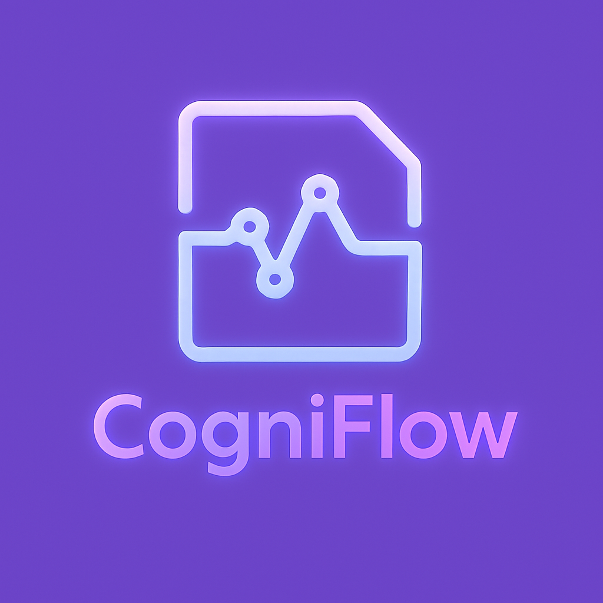

# CogniFlow: Interactive Learning Platform

CogniFlow is an interactive learning platform that uses AI to help users create flashcards, study, and teach concepts back to improve their learning experience.



## Features

- **Flashcard Generation**: Create flashcards from text prompts or PDF uploads
- **Teaching Mode**: Practice explaining concepts while getting AI feedback
- **Evaluation System**: Receive scores on your teaching performance
- **Interactive UI**: Modern, responsive interface with webcam integration
- **Text-to-Speech**: AI-powered voice responses for a more natural learning experience

## Technology Stack

### Frontend
- Next.js 15 with React 19
- Tailwind CSS 4 for styling with shadcn/ui components
- Zustand for state management with persistence
- Framer Motion for animations

### Backend
- FastAPI for API endpoints
- Google Cloud APIs (Speech-to-Text, Gemini)
- OpenAI for Text-to-Speech capabilities
- PDF processing libraries

## Getting Started

### Prerequisites
- Node.js 18+ and npm/yarn
- Python 3.8+ for the backend
- Google Cloud and OpenAI API keys

### Frontend Setup
1. Clone the repository
2. Navigate to the project directory:
   ```
   cd vibe-learning
   ```
3. Install dependencies:
   ```
   npm install
   ```
4. Create a `.env` file with necessary environment variables:
   ```
   NEXT_PUBLIC_API_URL=http://localhost:8000/api
   ```
5. Start the development server:
   ```
   npm run dev
   ```

### Backend Setup
1. Navigate to the backend directory:
   ```
   cd backend
   ```
2. Create a virtual environment:
   ```
   python -m venv venv
   source venv/bin/activate  # On Windows: venv\Scripts\activate
   ```
3. Install dependencies:
   ```
   pip install -r requirements.txt
   ```
4. Set up your Google Cloud credentials and API keys in a `.env` file
5. Start the backend server:
   ```
   uvicorn app.main:app --reload
   ```

## Project Structure

- `/app`: Next.js pages and application logic
- `/components`: Reusable React components
- `/lib`: Utility functions and API clients
- `/public`: Static assets
- `/store`: Zustand state management
- `/backend`: FastAPI server and AI integration

## How to Use

### Creating Flashcards
1. Enter a subject in the main input box or select from example prompts
2. Review and edit the generated flashcards
3. Save your deck for studying later

### Teaching Mode
1. Select a flashcard deck to teach
2. Use the webcam to record yourself explaining concepts
3. Receive AI feedback on your explanations
4. View your evaluation scores

## What We Learned

Throughout this project, we learned how to integrate various technologies, such as:
- Using React 19 and Next.js 15 for building dynamic user interfaces
- Implementing Tailwind CSS 4 for responsive and modern styling
- Creating a flashcard learning system with teaching and evaluation capabilities
- Leveraging Zustand for state management across components
- Implementing Google Gemini and OpenAI APIs for AI-driven features
- Using browser APIs to handle audio/video streams for webcam and speech recording
- Managing themes (light/dark mode) using next-themes

## How We Built It

- Frontend: Built with Next.js and styled using Tailwind CSS with shadcn/ui components. Features like WebcamView and TeachingChat provide interactive learning experiences.
- Backend: Powered by FastAPI with Google Cloud (Speech, Gemini) and OpenAI integration for AI features like transcription, text-to-speech, and intelligent responses.
- State Management: Used Zustand with persist middleware for client-side state management, handling flashcards, chat interactions, and evaluation data.
- Media Processing: Implemented browser MediaRecorder API for capturing audio/video, with comprehensive error handling and format compatibility.

## License

This project is licensed under the MIT License - see the LICENSE file for details.
